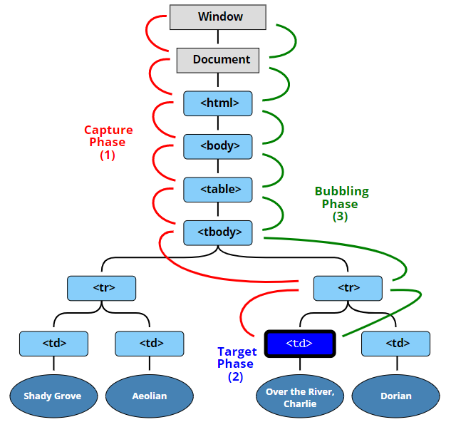

# bubbling
버블링이란 한 요소에 이벤트가 발생하면, 요소는 핸들러에 의해 동작하게 되고, 부모요소가 있다면 부모요소도 핸들러가 동작한다. 이렇게 가장 최상단의 조상 요소를 만날 때 까지 이 과정이 반복되면서 각각의 핸들러가 동작한다.
- event.target: 실제 이벤트가 시작된 `타깃` 요소이다. 버블링이 진행되어도 변하지 않는다.
- this: `현재`요소로 현재 실행 중인 핸들러가 할당된 요소를 참조한다.
# Capturing
캡처링은 최상위 요소에서 이벤트가 발생한 타깃까지 핸들러가 동작하는 과정이다. 하지만 대부분 버블링이 많이 된다. 왜냐하면 EventListener에 {capture: true}를 선언을 안한다면 핸들러가 동작하지 않기 때문에 버블링만 일어나고 끝나기 때문이다. 

>**참조** 
>https://ko.javascript.info/bubbling-and-capturing